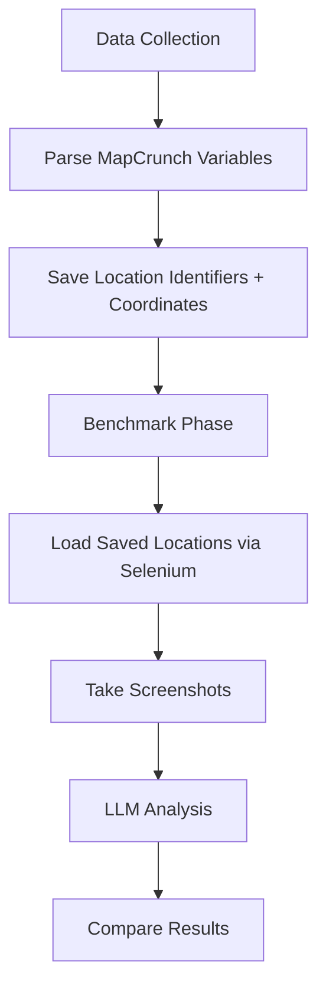

# MapCrunch Geo-Location AI Benchmark

A comprehensive benchmark system for testing AI models' ability to determine geographic locations from Street View images using MapCrunch.

## Features

- 🤖 **Multi-model support**: GPT-4o, Claude 3.5 Sonnet, Gemini 1.5 Pro
- 🌍 **MapCrunch integration**: Automated browser control with Selenium
- 📊 **Data collection**: Automated golden label collection
- 🏁 **Benchmarking**: Comprehensive performance evaluation
- 🎮 **Interactive mode**: Manual testing and exploration
- 📈 **Visualization**: Map plotting and result analysis

## Architecture

### Core Components

1. **`config.py`** - Configuration for models, selectors, and paths
2. **`mapcrunch_controller.py`** - Selenium automation for MapCrunch website
3. **`geo_bot.py`** - Core bot logic with coordinate conversion and LLM integration
4. **`data_collector.py`** - Automated golden label and screenshot collection
5. **`benchmark.py`** - Benchmark system for model evaluation
6. **`main_single_player.py`** - Main entry point with multiple modes

### Data Flow

```
MapCrunch Website → Selenium Controller → Screenshot + Coordinates → Golden Labels
                                      ↓
Golden Labels → Benchmark System → Model Testing → Results & Analysis
```

## Installation

```bash
# Install dependencies
pip install -r requirements.txt

# Install Chrome WebDriver (required for Selenium)
# MacOS with Homebrew:
brew install chromedriver

# Or download from: https://chromedriver.chromium.org/
```

## Quick Start

### 1. Collect Training Data

```bash
# Collect 100 samples with golden labels
python main_single_player.py --mode data --samples 100

# Run headless (no browser window)
python main_single_player.py --mode data --samples 50 --headless
```

### 2. Run Benchmark

```bash
# Test multiple models on saved data
python main_single_player.py --mode benchmark --models gpt-4o claude-3.5-sonnet --samples 20

# Live benchmark (uses MapCrunch directly)
python main_single_player.py --mode benchmark --live --models gpt-4o --samples 10
```

### 3. Interactive Testing

```bash
# Play interactively with a specific model
python main_single_player.py --mode interactive --model gpt-4o --turns 5 --plot

# Generate visualization plots
python main_single_player.py --mode interactive --model claude-3.5-sonnet --plot
```

## Configuration

### Models

Edit `config.py` to add new models:

```python
MODELS_CONFIG = {
    'custom-model': {
        'class': 'ChatOpenAI',  # or ChatAnthropic, ChatGoogleGenerativeAI
        'model_name': 'custom-model-name',
    }
}
```

### Environment Variables

Create a `.env` file:

```bash
OPENAI_API_KEY=your_openai_key
ANTHROPIC_API_KEY=your_anthropic_key  
GOOGLE_API_KEY=your_google_key
```

## Usage Examples

### Data Collection
```bash
# Collect location identifiers (fast, no LLM calls)
python data_collector.py --samples 100

# Clean invalid samples
python data_collector.py --clean
```

### Benchmarking
```bash
# Comprehensive benchmark
python benchmark.py --models gpt-4o claude-3.5-sonnet gemini-1.5-pro --samples 50

# Quick test
python benchmark.py --models gpt-4o --samples 10
```

## Data Structure

### Location Data Format (Data Collection Output)
```json
{
  "metadata": {
    "collection_date": "2024-01-01T12:00:00",
    "total_samples": 100,
    "description": "MapCrunch location identifiers and coordinates"
  },
  "samples": [
    {
      "id": "uuid",
      "timestamp": "2024-01-01T12:00:00",
      "coordinates": {
        "lat": 40.7128,
        "lng": -74.0060,
        "source": "mapcrunch_initString"
      },
      "identifiers": {
        "initString": "40.7128_-74.0060_180_10_0",
        "initPanoId": "pano_id_here",
        "permLink": "http://www.mapcrunch.com/s/...",
        "url": "https://www.mapcrunch.com/..."
      }
    }
  ]
}
```

### Benchmark Results Format
```json
{
  "sample_id": "uuid", 
  "model": "gpt-4o",
  "true_coordinates": {"lat": 40.7128, "lng": -74.0060},
  "predicted_coordinates": [40.7000, -74.0100],
  "distance_km": 1.5,
  "inference_time": 2.3,
  "success": true,
  "mode": "selenium"
}
```

## Key Improvements from Original

### 🔧 **Automated Setup**
- ✅ No manual screen region selection
- ✅ Automatic browser launching
- ✅ Selenium-based UI control

### 📊 **Efficient Data Management** 
- ✅ Lightweight data collection (location identifiers only, no screenshots)
- ✅ Selenium location reproduction for testing
- ✅ Proper data validation and cleaning
- ✅ No storage overhead during collection phase

### 🏗️ **Better Architecture**
- ✅ Separated data collection from testing
- ✅ Data collection: Parse page variables (fast, free)
- ✅ Benchmark: Load locations + screenshot + LLM analysis
- ✅ Configuration-based model management

### 🧪 **Enhanced Testing**
- ✅ Batch benchmarking across models
- ✅ Statistical analysis and reporting
- ✅ Error handling and recovery
- ✅ Reproducible location loading

## Files Overview

| File | Purpose | Key Features |
|------|---------|--------------|
| `config.py` | Configuration | Model configs, selectors, paths |
| `mapcrunch_controller.py` | Browser automation | Selenium WebDriver integration |
| `geo_bot.py` | Core bot logic | LLM integration, coordinate conversion |
| `data_collector.py` | Location data collection | Parse page variables, save identifiers |
| `benchmark.py` | Model evaluation | Load locations, screenshot, LLM testing |
| `main_single_player.py` | Entry point | Multi-mode CLI interface |

## Architecture Flow



## Troubleshooting

### Common Issues

1. **Chrome WebDriver not found**
   ```bash
   # Install ChromeDriver
   brew install chromedriver  # MacOS
   # Or download manually and add to PATH
   ```

2. **Element not found errors**
   - MapCrunch website may have changed
   - Update selectors in `config.py`

3. **Coordinate conversion issues**
   - Check reference points in `config.py`
   - Calibrate using known locations

4. **API rate limits**
   - Add delays between requests
   - Use different API keys for parallel testing

### Performance Tips

- Use `--headless` for faster data collection
- Batch process samples to reduce API calls
- Cache screenshots for repeated testing
- Use offline mode for development

## Contributing

1. Fork the repository
2. Create a feature branch
3. Add tests for new functionality
4. Submit a pull request

## License

MIT License - see LICENSE file for details.